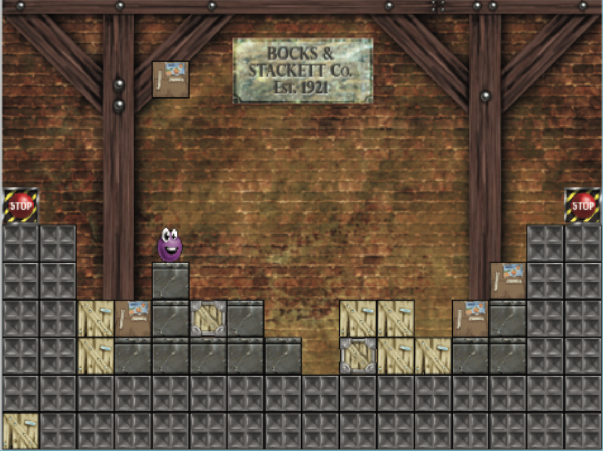

# GetLazarusOutOfThePitGame
A single player puzzle game where the objective is to save the character Lazarus from being crushed by boxes by moving him to the stop button. Lazarus can only move up and down one box height or side to side if the heights are the same. A random box will appear on the bottom left hand corner of the screen and that box after a few seconds will drop at Lazarus' previous location. Each box has different weight and any box with higher weight that drops on a box with lower weight will keep crushing the box under until the falling box hits a box with higher or same weight. In stacking boxes in such a way you are able to stack boxes high enough for Lazarus to get to the stop button.

## High level class hierarchy design

